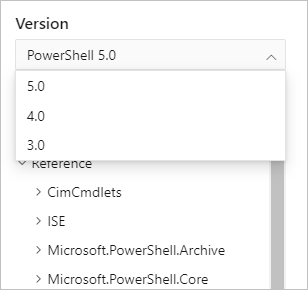

# Previous versions of PowerShell

This documentation set contains PowerShell cmdlet reference for older versions of PowerShell. The
documentation for these versions is not actively being updated.

For the latest documentation, see the [PowerShell Reference](/powershell/scripting/overview) site.

This site has release notes for the following versions:

- PowerShell 7.3
- PowerShell 7.1
- PowerShell 6.x
- Windows PowerShell 5.1
- Windows Management Framework (WMF) 5.0 and 5.1

This site has cmdlet reference for the following versions:

- PowerShell 7.3
- PowerShell 7.1
- PowerShell 6.x
- PowerShell 5.0
- PowerShell 4.0
- PowerShell 3.0

Use the version picker in the at the top of the page to select the version of PowerShell reference
you want.

