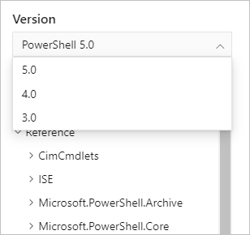

# PowerShell

This documentation set contains PowerShell cmdlet reference for older versions of PowerShell. The
documentation for these versions is not actively being updated.

For the latest documentation, see the [PowerShell Reference](/powershell/scripting/overview) site.

This site contains cmdlet reference for the following versions:

- PowerShell 3.0
- PowerShell 4.0
- PowerShell 5.0

Use the version picker in the at the top of the page to select the version of PowerShell you want.

